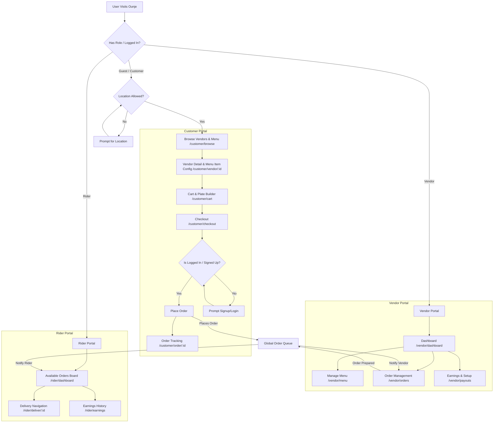

# Ounje E-Commerce Portal Transition Plan

This document outlines the architectural changes, code additions, and structural shifts required to transition Ounje from a static "pitch deck" style landing page into a functional three-role e-commerce web application.

---

## 1. Architectural Strategy & Role-Based Access

Currently, Ounje is a single page React application with client-side routing only for marketing pages (`/aboutus`, `/contactus`, `/privacyandcompliance`). 

To support actual business transactions, we must introduce:
*   **Authentication & Role State:** Track whether a user is logged in as a **Customer**, **Vendor**, or **Rider**.
    *   *Frictionless Customer Flow:* Customers do not need to log in or register to browse stores and configure orders. They only need to supply/grant location access.
    *   *Persistent Login Button:* A login button is always visible in the header for customers/vendors/riders to log in voluntarily at any time.
    *   *Signup on Checkout:* If a guest customer attempts to checkout, they are prompted to sign up/login to complete the order.
*   **Role-Based Routing:** Guard routes based on user type to prevent customers from seeing the rider panel or vendors from accessing customer carts.
*   **Shared Global State:** Keep track of the active user profile, shopping cart, and live order details.

### Recommended Tech Upgrades
1.  **State Management:** Introduce **Zustand** or **React Context** for global state. Zustand is recommended for its lightweight, boilerplate-free state management.
2.  **Routing Guard System:** Set up private/protected routes using `react-router-dom`.
3.  **Local Storage Persistence:** Store JWT tokens/user data locally to preserve sessions on refresh.

---

## 2. Mermaid Architecture & User Flows

The diagram below details the revised routing structure and how the different portals interact with the data layer.



---

## 3. What Needs to Change in Existing Files

To make room for the three portals, the current marketing files need to be refactored from "feature guides" into access points.

| File Path | Current Status | Required Modification |
| :--- | :--- | :--- |
| [App.tsx](file:///c:/Users/HP/Documents/GitHub/ounje-landingpage/src/App.tsx) | Simple routes for landing, about, contact pages. | Add route guards (`<ProtectedRoute role="...">`) and route configurations for all portal pages (including separate auth flows). |
| [Header.tsx](file:///c:/Users/HP/Documents/GitHub/ounje-landingpage/src/components/Header.tsx) | Links scroll to landing sections. | Add a persistent "Login" / "Portal" navigation button. Replace local landing scroll links with portal navigation or a "Go to Portal" action when logged in. |
| [HeroSection.tsx](file:///c:/Users/HP/Documents/GitHub/ounje-landingpage/src/components/HeroSection.tsx) | "Order via WhatsApp" / Waitlist CTAs. | Redesign the hero section to feature an interactive location search field. It will display simulated Google Place suggestions in a dropdown menu. Pressing the "Order Now" button will save the location state and navigate directly to the customer portal `/customer/browse`. |
| [CustomerSection.tsx](file:///c:/Users/HP/Documents/GitHub/ounje-landingpage/src/components/CustomerSection.tsx) | Interactive presentation wheel showcasing what "will be" built. | Refactor this into the actual **Customer Browse / Menu customizer page**. Take the "Build a Plate" mock data and implement it as a functional checkout builder. |
| [VendorSection.tsx](file:///c:/Users/HP/Documents/GitHub/ounje-landingpage/src/components/VendorSection.tsx) | Static details highlighting vendor perks. | Redesign the layout to include a clear CTA button ("Join as a Vendor" / "Vendor Log In") that routes the user directly to the new vendor authentication flow at `/vendor/auth`. |
| [RiderSection.tsx](file:///c:/Users/HP/Documents/GitHub/ounje-landingpage/src/components/RiderSection.tsx) | Static marketing block for riders. | Redesign the layout to include a clear CTA button ("Become a Rider" / "Rider Log In") that routes the user directly to the new rider authentication flow at `/rider/auth`. |

---

## 4. What Needs to Be Added

To turn this into a live e-commerce ecosystem, we must implement the following new components, pages, and systems:

### A. Auth & State Systems (Core)
*   **`useAuthStore`:** A hook managing the authenticated user role, token, and info.
*   **`useCartStore`:** A customer hook managing active items in the cart, customized toppings, quantities, and vendor constraints.
*   **`useOrderStore`:** A shared interface keeping track of active orders, status updates (`Order Placed` -> `Preparing` -> `In Transit` -> `Delivered`).

### B. Customer Portal Addition (`/customer/*`)
1.  **Dashboard/Browse Page (`/customer/browse`):**
    *   Reads location parameters from the landing search input or requests location access.
    *   List of nearby vendors/bukas.
    *   Search bar, filtering by food types (e.g., Soups, Rices, Grills).
2.  **Vendor Menu Page (`/customer/vendor/:id`):**
    *   Vendor menu grid.
    *   Clicking an item opens the **Plate Customizer Dialog** (replacing the static "Build a Plate" visualization with a functional item option selector).
3.  **Checkout & Payment Page (`/customer/checkout`):**
    *   If user is NOT logged in: Intercepts the checkout flow to request Signup/Login.
    *   If user is logged in: Displays simulated payment portal (e.g., Paystack mockup or cash on delivery) and address selection inputs.
4.  **Live Tracker Page (`/customer/order/:id`):**
    *   A simulated live delivery tracking map page showing order stages.

### C. Vendor Portal Addition (`/vendor/*`)
1.  **Vendor Authentication (`/vendor/auth`):**
    *   Dedicated login and registration views tailored specifically for vendors (fields for Business Name, Buka location, profile image, contact details).
2.  **Dashboard Overview (`/vendor/dashboard`):**
    *   Overview of today's sales, average cooking time, active reviews.
3.  **Order Manager (`/vendor/orders`):**
    *   Tabs for: `Incoming` (Accept/Decline), `Preparing` (Mark as Ready), `Ready for Pickup`.
4.  **Menu & Inventory Manager (`/vendor/menu`):**
    *   Form to create, edit, delete menu items.
    *   Toggle fields to mark items as "Out of stock".

### D. Rider Portal Addition (`/rider/*`)
1.  **Rider Authentication (`/rider/auth`):**
    *   Dedicated signup and signin interface for delivery riders (fields for vehicle description, vehicle number, phone number, ID verification).
2.  **Job Board (`/rider/dashboard`):**
    *   Geolocated card list of orders ready for pickup.
    *   Rider can click "Accept Order".
3.  **Active Job Navigation (`/rider/deliver/:id`):**
    *   Directions showing Vendor location (Pickup) and Customer location (Drop-off).
    *   Actions to: `Mark as Picked Up`, `Mark as Completed`.
4.  **Earnings Analytics (`/rider/earnings`):**
    *   List of completed trips and calculated daily payouts.

---

## 5. Recommended Verification & Phase Schedule

To ensure a smooth transition without breaking current designs, we recommend this phased development strategy:

```
┌────────────────────────────────────────────────────────┐
│ Phase 1: Auth & Store Infrastructure                   │
│ - Set up Zustand state stores (Auth, Cart, Orders).    │
│ - Set up guarded routes in react-router-dom.           │
└───────────────────────────┬────────────────────────────┘
                            ▼
┌────────────────────────────────────────────────────────┐
│ Phase 2: Customer Flow Completion                      │
│ - Build location query step & vendor browse pages.     │
│ - Build functional checkout with authentication prompt │
│   for guest checkout conversion.                       │
└───────────────────────────┬────────────────────────────┘
                            ▼
┌────────────────────────────────────────────────────────┐
│ Phase 3: Vendor & Rider Dashboard Portals              │
│ - Implement menu manager, order acceptance interface.   │
│ - Set up rider accept-to-delivery flow hooks.           │
└────────────────────────────────────────────────────────┘
```
